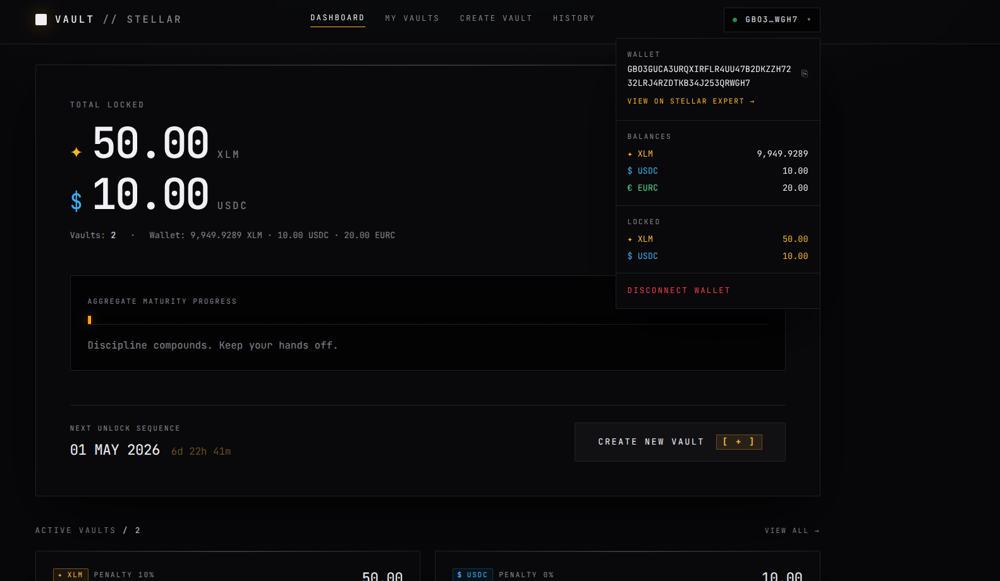
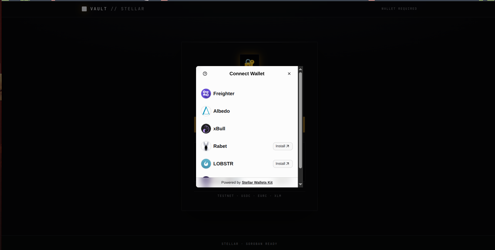
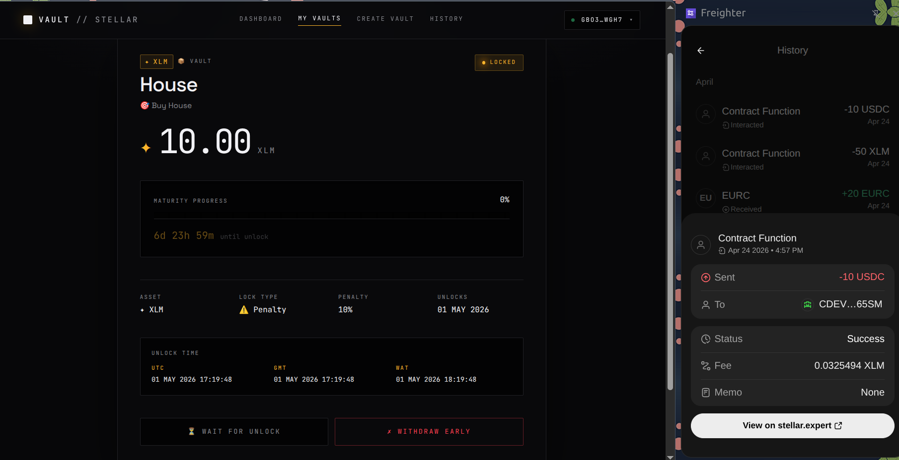
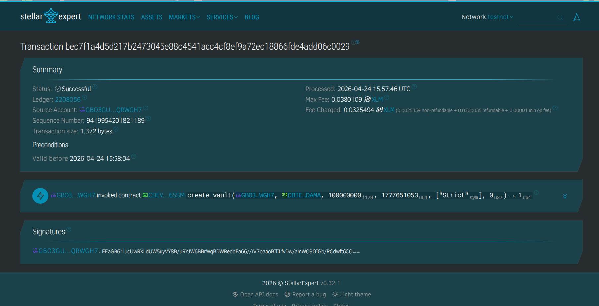
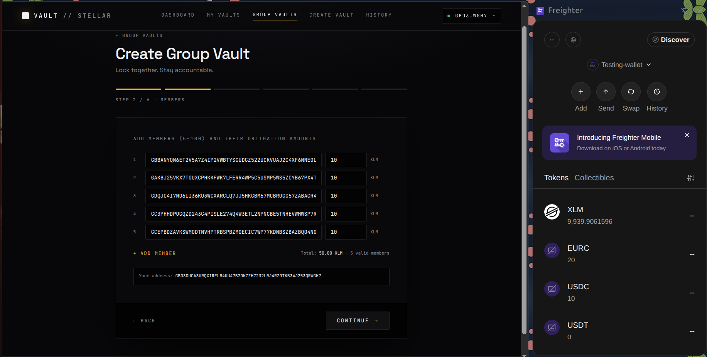
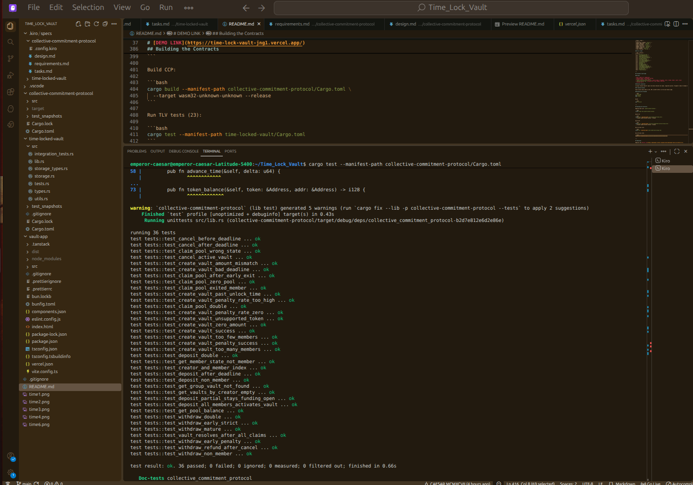
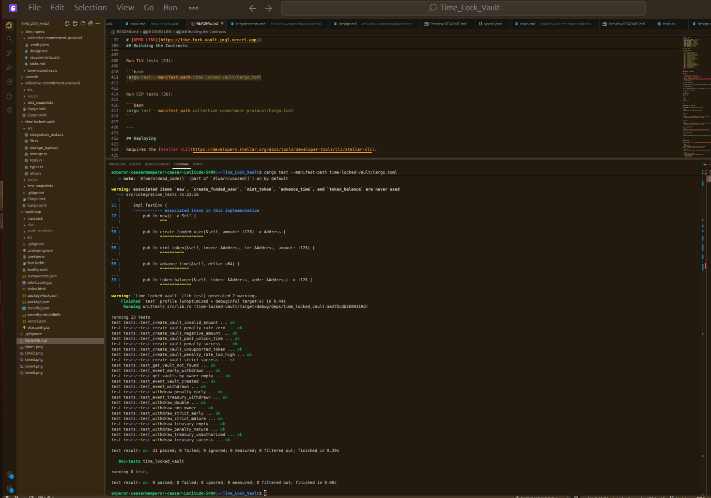
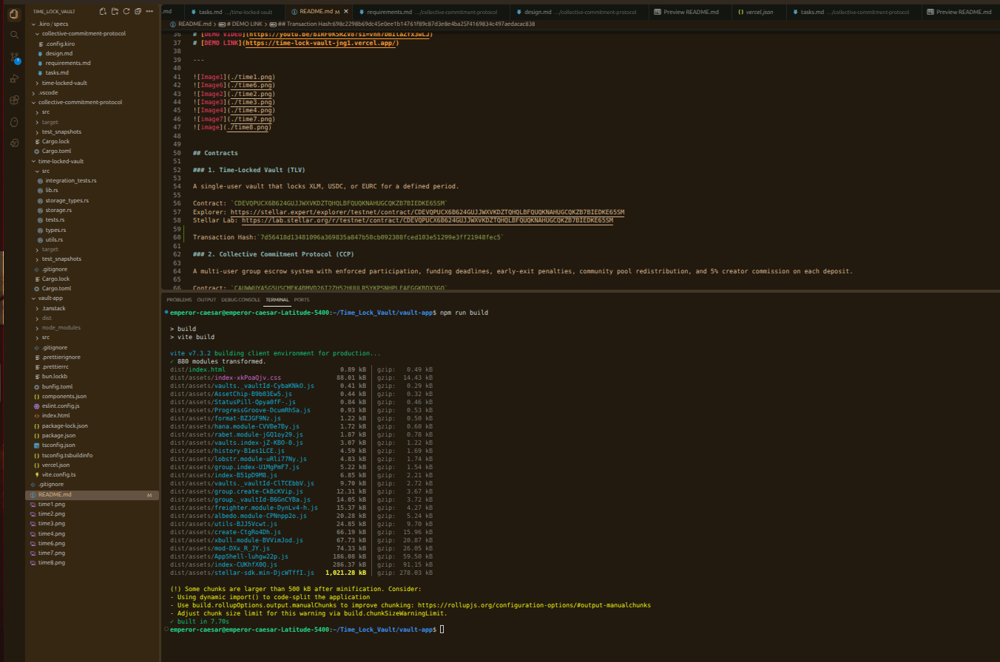
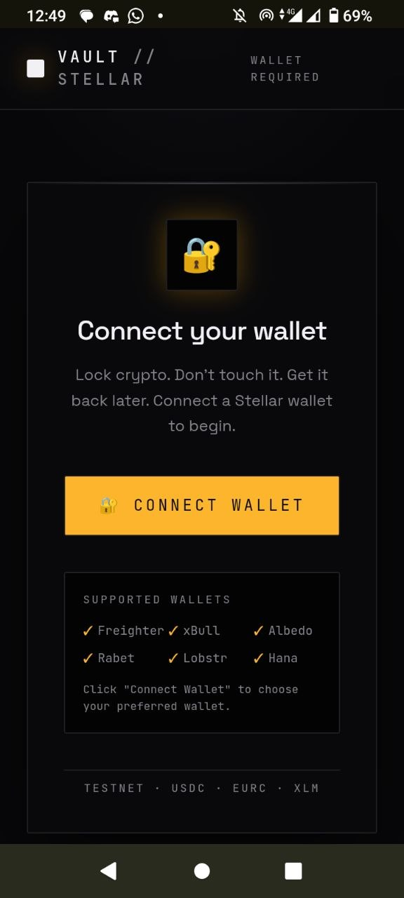

# Time-Locked Vault Protocol

A time-locked asset vault protocol on Stellar. One Soroban smart contract manages many vaults — users deposit XLM, USDC, or EURC and lock them for a defined period. A React dApp frontend connects to the contract via Stellar Wallets Kit.

A collective group vault where assigned wallet address users deposit XLM, USDC OR EURC and lock them for a defined period for a definite goal.

Two standalone Soroban smart contracts on Stellar testnet — a solo time-locked vault and a collective group commitment protocol.


The "trusted individual" — the vault creator — earns two things:

**1. Creator Commission (5%)**
Every time a member deposits, 5% goes immediately to the creator's wallet. This happens on-chain at deposit time — no claiming needed.

Example with 5 members each depositing 100 XLM:
- Member 1 deposits → creator gets 5 XLM instantly
- Member 2 deposits → creator gets 5 XLM instantly
- Member 3 deposits → creator gets 5 XLM instantly
- Member 4 deposits → creator gets 5 XLM instantly
- Member 5 deposits → creator gets 5 XLM instantly
- Total creator earnings: **25 XLM** just for creating the vault

**2. Nothing from the penalty pool**
The creator does NOT get any share of the early-exit penalty pool. That pool is distributed equally among members who stayed committed to maturity. The creator only earns the upfront commission.

**Summary**

| Source | Creator earns | When |
|---|---|---|
| Member deposits | 5% of each deposit | Immediately at deposit time |
| Penalty pool | 0% | N/A |
| Mature withdrawals | 0% | N/A |

So if you create a vault with 100 members each depositing 1000 XLM, you earn **5,000 XLM** just from the commission — before the lock period even starts.

# [FEEDBACK FORM](https://docs.google.com/forms/d/e/1FAIpQLSd8yYsMPeXXW_IKsqweEI2hh7mjujBGxij_VTEt02S2NizdlQ/viewform)
# [DEMO VIDEO](https://youtu.be/bIRF0K5RZV8?si=vnh7DBIlaZfx3wLJ)
# [DEMO LINK](https://time-lock-vault-jng1.vercel.app/)

---










## Contracts

### 1. Time-Locked Vault (TLV)

A single-user vault that locks XLM, USDC, or EURC for a defined period.

Contract: `CDEVQPUCX6B624GUJJWXVKDZTQHQLBFQUQKNAHUGCQKZB7BIEDKE65SM`
Explorer: https://stellar.expert/explorer/testnet/contract/CDEVQPUCX6B624GUJJWXVKDZTQHQLBFQUQKNAHUGCQKZB7BIEDKE65SM
Stellar Lab: https://lab.stellar.org/r/testnet/contract/CDEVQPUCX6B624GUJJWXVKDZTQHQLBFQUQKNAHUGCQKZB7BIEDKE65SM

Transaction Hash:`7d56418d13481096a369835a847b50cb092308fced103e51299e3ff21948fec5`

### 2. Collective Commitment Protocol (CCP)

A multi-user group escrow system with enforced participation, funding deadlines, early-exit penalties, community pool redistribution, and 5% creator commission on each deposit.

Contract: `CAUWWUYA5G5USCMEK4BMVD26I2ZH52HUULR5YKPSNHPLFAEGGKBDX3GO`
Explorer: https://stellar.expert/explorer/testnet/contract/CAUWWUYA5G5USCMEK4BMVD26I2ZH52HUULR5YKPSNHPLFAEGGKBDX3GO
Stellar Lab: https://lab.stellar.org/r/testnet/contract/CAUWWUYA5G5USCMEK4BMVD26I2ZH52HUULR5YKPSNHPLFAEGGKBDX3GO

Transaction Hash:`698c2298b69dc45e0ee1b14761f89c87d3e8e4ba25f4169834c497aedacac838`
---


## List of 5+ user wallet addresses (verifiable on Stellar Explorer)
```
Address 1: `GBBANYQN6ET2V5A7Z4IP2VWBTYSGUDGZ522UCKVUAJ2C4XF6NNEOL7ZT`
Address 2: `GAKBJ25VKX7TOUXCPHKKFWK7LFERR4WP5C5USMP5WS5ZCYB67PX4THUB`
Address 3: `GDQJC4I7ND6LI36KU3WCXARCLQ7JJ5HKGBM67MCBROGG57ZABACR4SK2`
Address 4: `GC3PHHDPOGQZD243G4PISLE274Q4W3ETL2NPNGBE5TNHEVWMWSP7RJKM`
Address 5: `GCEPBDZAVKSWMODTNVHPTRBSPBZMOECIC7WP77KDNBSZBAZBQO4NO6J7`
```
## Supported Assets (both contracts)

| Asset | SAC Address (Testnet) |
|---|---|
| XLM | `CDLZFC3SYJYDZT7K67VZ75HPJVIEUVNIXF47ZG2FB2RMQQVU2HHGCYSC` |
| USDC | `CBIELTK6YBZJU5UP2WWQEUCYKLPU6AUNZ2BQ4WWFEIE3USCIHMXQDAMA` |
| EURC | `CDTK22VXFIBQTJKX6HOA3VWQBTG335LDKM56OO3RIJIPYIUK6PPMURS3` |

---

## Project Structure

```
Time_Lock_Vault/
├── time-locked-vault/              # Solo vault contract (Rust/Soroban)
│   ├── Cargo.toml
│   └── src/
│       ├── lib.rs                  # initialize, create_vault, withdraw, withdraw_treasury, queries
│       ├── types.rs                # LockType, VaultState, Vault, event structs
│       ├── storage_types.rs        # DataKey, VaultError
│       ├── storage.rs              # Storage helpers, TTL management
│       ├── utils.rs                # calculate_penalty, token_client
│       ├── tests.rs                # 23 unit tests
│       └── integration_tests.rs
├── collective-commitment-protocol/ # Group vault contract (Rust/Soroban)
│   ├── Cargo.toml
│   └── src/
│       ├── lib.rs                  # All 12 public functions
│       ├── types.rs                # VaultState, MemberState, LockType, GroupVault, MemberRecord, events
│       ├── storage_types.rs        # DataKey, CcpError
│       ├── storage.rs              # Storage helpers, TTL management
│       ├── utils.rs                # calculate_penalty, token_client, state transition helpers
│       ├── tests.rs                # 36 unit tests
│       └── integration_tests.rs
├── vault-app/                      # React frontend (Vite + TanStack Router)
│   └── src/
│       ├── lib/
│       │   ├── contract.ts         # TLV Soroban client (lazy SDK, SSR-safe)
│       │   ├── stellar-helper.ts   # Stellar Wallets Kit integration (lazy, SSR-safe)
│       │   ├── assets.ts           # Asset registry (XLM, USDC, EURC)
│       │   └── format.ts           # Date/time formatting incl. UTC/GMT/WAT
│       ├── store/
│       │   ├── wallet.ts           # Wallet state (connect, sign, balances)
│       │   └── vaults.ts           # Vault state (fetch, create, withdraw)
│       └── routes/
│           ├── index.tsx           # Dashboard
│           ├── create.tsx          # Create vault (6-step wizard)
│           ├── vaults.$vaultId.tsx # Vault detail + UTC/GMT/WAT unlock time
│           └── history.tsx         # Transaction history
└── .kiro/specs/
    ├── time-locked-vault/          # TLV spec (requirements, design, tasks)
    └── collective-commitment-protocol/ # CCP spec (requirements, design, tasks)
```

---

## Contract 1: Time-Locked Vault

### What It Does

- User deposits XLM, USDC, or EURC and locks for a defined period
- Two lock types: Strict (no early exit) or Penalty (early exit with configurable fee)
- Penalty fees accumulate in a protocol treasury
- Protocol owner can drain the treasury

### Functions

| Function | Description |
|---|---|
| `initialize(protocol_owner, xlm_token, usdc_token, eurc_token)` | One-time setup |
| `create_vault(caller, token, amount, unlock_time, lock_type, penalty_rate)` | Lock funds, returns `vault_id` |
| `withdraw(caller, vault_id)` | Withdraw at maturity or early (penalty vaults only) |
| `withdraw_treasury(caller, token)` | Protocol owner drains penalty fees |
| `get_vault(vault_id)` | Read vault record |
| `get_vaults_by_owner(owner)` | List all vault IDs for an owner |
| `get_treasury_balance(token)` | Read accumulated penalty balance |

### Penalty Calculation

```
penalty = floor(amount * penalty_rate / 10_000)
payout  = amount - penalty
```

`payout + penalty == amount` always holds — no value lost.

### Events

| Event | Topic |
|---|---|
| Vault created | `vault_crt` |
| Mature withdrawal | `withdrawn` |
| Early withdrawal | `early_wdr` |
| Treasury drained | `treas_wdr` |

### Error Codes

| Code | Variant |
|---|---|
| 1 | `AlreadyInitialized` |
| 10 | `InvalidAmount` |
| 11 | `InvalidUnlockTime` |
| 12 | `UnsupportedToken` |
| 13 | `InvalidPenaltyRate` |
| 20 | `VaultNotFound` |
| 21 | `AlreadyWithdrawn` |
| 22 | `EarlyExitNotAllowed` |
| 30 | `Unauthorized` |
| 40 | `TreasuryEmpty` |

---

## Group Vault Lifecycle

### Vault States

| State | Description |
|---|---|
| Funding Open | Vault created — waiting for all members to deposit before the funding deadline |
| Active Locked | All members deposited — funds locked until unlock time |
| Settlement Ready | Unlock time reached — members can withdraw principal and claim pool shares |
| Resolved | All members have claimed — vault fully closed |
| Cancelled | Funding deadline passed without full funding — depositors can claim refunds |

### Member States

| State | Description |
|---|---|
| Committed | Added to vault by creator, hasn't deposited yet — **deposit button shows here** |
| Deposited | Deposited their obligation amount, waiting for all others to deposit |
| Active | Vault fully funded and locked, member is in good standing |
| Exited | Exited early (penalty vault only) — forfeited penalty to community pool, irreversible |
| Withdrawn | Withdrew principal at maturity |
| Claimed | Claimed their share of the community pool |

### Full Lifecycle Flow

```
Creator creates vault
    ↓
All members → COMMITTED state
    ↓ (each member deposits before funding deadline)
Members → DEPOSITED state
    ↓ (last member deposits → vault auto-activates)
All members → ACTIVE state · Vault → ACTIVE LOCKED
    ↓ (unlock time arrives)
Vault → SETTLEMENT READY
    ↓ (members withdraw principal)
Members → WITHDRAWN state
    ↓ (members claim pool share)
Members → CLAIMED state · Vault → RESOLVED
```

If the funding deadline passes before all members deposit:
```
Vault → CANCELLED
    ↓ (depositors call withdraw)
Each depositor receives full refund
```

The deposit button only appears when a member is in **Committed** state and the vault is in **Funding Open** state before the deadline.

### Creator Commission

When a member deposits, 5% of their deposit goes immediately to the vault creator as a commission. The remaining 95% is locked in the contract.

Example: member deposits 100 XLM → 5 XLM to creator, 95 XLM locked.

---


When you create a group vault, you add 5–100 member wallet addresses and set a funding deadline (e.g. 48 hours).

Each member then visits the Group Vault detail page (`/group/$vaultId`) with their own wallet connected. If their state shows "Committed" and the deadline hasn't passed, they see a deposit button:

```
✦ Deposit 100 XLM
```

They click it, sign with their wallet, and their funds go directly into the contract. The funding progress bar updates as each member deposits.

**Important**: members do NOT deposit to your address. They deposit directly to the contract address. The contract holds all funds in escrow — nobody (including the creator) can touch them. Only the contract logic controls when and how funds move.

**How members find the vault**: each member's wallet address was added to the member list at creation time. When they connect their wallet on the Group Vaults page, the vault automatically appears in their list. You can also share the direct URL `/group/$vaultId`.

**What happens if funding fails**: if the deadline passes and not all members have deposited, anyone can call `cancel`. The vault is cancelled and every depositor can claim a full refund — zero funds remain locked.

---

## Contract 2: Collective Commitment Protocol

### What It Does

A permissioned multi-party escrow protocol with enforced participation, deterministic settlement, and adversarial-safe economic redistribution.

- Creator assembles a group of 5–100 members, each with a fixed obligation amount
- Members deposit their exact amount before a funding deadline
- If funding fails (deadline passes without full funding) → vault is cancelled, all depositors refunded
- If fully funded → vault locks until unlock_time
- Early exit (Penalty vaults): member forfeits penalty to a community pool
- At maturity: members withdraw their principal + claim equal share of the community pool
- Zero stuck-funds guarantee: every vault resolves exactly once

### State Machine

```
FundingOpen → ActiveLocked → SettlementReady → Resolved
           ↘ Cancelled (funding deadline missed)
```

### Member State Machine

```
Committed → Deposited → Active → Withdrawn → Claimed
                               ↘ Exited (early exit, irreversible)
```

### Functions

| Function | Description |
|---|---|
| `initialize(xlm_token, usdc_token, eurc_token)` | One-time setup |
| `create_group_vault(creator, token, members, amounts, unlock_time, funding_deadline, lock_type, penalty_rate)` | Create group vault, returns `vault_id` |
| `deposit(caller, vault_id)` | Member deposits their exact obligation amount |
| `withdraw(caller, vault_id)` | Refund (cancelled), mature withdrawal, or early exit |
| `cancel(vault_id)` | Cancel vault after funding deadline — anyone can call |
| `claim_pool(caller, vault_id)` | Claim equal share of community pool at settlement |
| `get_group_vault(vault_id)` | Read vault record |
| `get_member_state(vault_id, member)` | Read member record |
| `get_vaults_by_creator(creator)` | List vault IDs by creator |
| `get_vaults_by_member(member)` | List vault IDs by member |
| `get_pool_balance(vault_id)` | Read community pool balance |
| `get_member_claim_amount(vault_id, member)` | Preview member's pool share |

### Pool Distribution

```
base      = floor(original_pool / eligible_claimers)
remainder = original_pool % eligible_claimers
first_claimer_share = base + remainder
other_claimers_share = base
```

Sum of all claims == original pool. No value created or destroyed.

### Events

| Event | Topic |
|---|---|
| Group vault created | `grp_crt` |
| Member deposited | `mem_dep` |
| Vault activated | `vlt_act` |
| Vault cancelled | `vlt_can` |
| Member early exit | `mem_exit` |
| Member withdrawn | `mem_wdr` |
| Pool claimed | `pool_clm` |
| Vault resolved | `vlt_res` |

### Error Codes

| Code | Variant |
|---|---|
| 1 | `AlreadyInitialized` |
| 10 | `InvalidMemberCount` |
| 11 | `MemberAmountMismatch` |
| 12 | `InvalidObligationAmount` |
| 13 | `UnsupportedToken` |
| 14 | `InvalidUnlockTime` |
| 15 | `InvalidFundingDeadline` |
| 16 | `InvalidPenaltyRate` |
| 20 | `VaultNotFound` |
| 21 | `NotMember` |
| 22 | `WrongVaultState` |
| 23 | `WrongMemberState` |
| 24 | `FundingDeadlinePassed` |
| 25 | `FundingDeadlineNotPassed` |
| 26 | `EarlyExitNotAllowed` |
| 30 | `Unauthorized` |
| 40 | `TransferFailed` |

---

## Frontend (vault-app)

### Stack

- Vite + React 19 + TypeScript
- TanStack Router (file-based routing)
- Zustand (wallet + vault state)
- `@creit.tech/stellar-wallets-kit` (wallet modal — Freighter, xBull, Albedo, Rabet, Lobstr, Hana)
- `@stellar/stellar-sdk` (Soroban RPC — lazy loaded, SSR-safe)
- Tailwind CSS v4

### Wallet Connection

Clicking "Connect Wallet" opens the Stellar Wallets Kit modal. Supported wallets: Freighter · xBull · Albedo · Rabet · Lobstr · Hana

### Timezone Display

Vault unlock times shown in UTC, GMT, and WAT (UTC+1) on the vault detail page.

### Running the Frontend

```bash
cd vault-app
npm install
npm run dev
```

Build:

```bash
npm run build
```

---

## Building the Contracts

Requires Rust with `wasm32-unknown-unknown`:

```bash
rustup target add wasm32-unknown-unknown
```

Build TLV:

```bash
cargo build --manifest-path time-locked-vault/Cargo.toml \
  --target wasm32-unknown-unknown --release
```

Build CCP:

```bash
cargo build --manifest-path collective-commitment-protocol/Cargo.toml \
  --target wasm32-unknown-unknown --release
```

Run TLV tests (23):

```bash
cargo test --manifest-path time-locked-vault/Cargo.toml
```

Run CCP tests (36):

```bash
cargo test --manifest-path collective-commitment-protocol/Cargo.toml
```

---

## Deploying

Requires the [Stellar CLI](https://developers.stellar.org/docs/tools/developer-tools/cli/stellar-cli).

```bash
# Fund deployer
stellar keys generate deployer --network testnet
stellar keys fund deployer --network testnet

# Optimize
stellar contract optimize --wasm <path/to/contract.wasm>

# Deploy
stellar contract deploy \
  --wasm <path/to/contract.optimized.wasm> \
  --source deployer \
  --network testnet

# Initialize TLV
stellar contract invoke --id <CONTRACT_ID> --source deployer --network testnet \
  -- initialize \
  --protocol_owner <DEPLOYER_ADDRESS> \
  --xlm_token CDLZFC3SYJYDZT7K67VZ75HPJVIEUVNIXF47ZG2FB2RMQQVU2HHGCYSC \
  --usdc_token CBIELTK6YBZJU5UP2WWQEUCYKLPU6AUNZ2BQ4WWFEIE3USCIHMXQDAMA \
  --eurc_token CDTK22VXFIBQTJKX6HOA3VWQBTG335LDKM56OO3RIJIPYIUK6PPMURS3

# Initialize CCP
stellar contract invoke --id <CONTRACT_ID> --source deployer --network testnet \
  -- initialize \
  --xlm_token CDLZFC3SYJYDZT7K67VZ75HPJVIEUVNIXF47ZG2FB2RMQQVU2HHGCYSC \
  --usdc_token CBIELTK6YBZJU5UP2WWQEUCYKLPU6AUNZ2BQ4WWFEIE3USCIHMXQDAMA \
  --eurc_token CDTK22VXFIBQTJKX6HOA3VWQBTG335LDKM56OO3RIJIPYIUK6PPMURS3
```

---

## Testnet Deployment Info

| Item | Value |
|---|---|
| Network | Stellar Testnet |
| TLV Contract | `CDEVQPUCX6B624GUJJWXVKDZTQHQLBFQUQKNAHUGCQKZB7BIEDKE65SM` |
| CCP Contract | `CAUWWUYA5G5USCMEK4BMVD26I2ZH52HUULR5YKPSNHPLFAEGGKBDX3GO` |
| Protocol Owner | `GBAWEM6LAMZQIW6JRQPLEIZBZTQHRCUYGTZNCYIWD2BXOF4DE4QYA7OM` |
| XLM SAC | `CDLZFC3SYJYDZT7K67VZ75HPJVIEUVNIXF47ZG2FB2RMQQVU2HHGCYSC` |
| USDC SAC | `CBIELTK6YBZJU5UP2WWQEUCYKLPU6AUNZ2BQ4WWFEIE3USCIHMXQDAMA` |
| EURC SAC | `CDTK22VXFIBQTJKX6HOA3VWQBTG335LDKM56OO3RIJIPYIUK6PPMURS3` |
| RPC URL | `https://soroban-testnet.stellar.org` |
| Horizon URL | `https://horizon-testnet.stellar.org` |
| TLV Explorer | https://stellar.expert/explorer/testnet/contract/CDEVQPUCX6B624GUJJWXVKDZTQHQLBFQUQKNAHUGCQKZB7BIEDKE65SM |
| CCP Explorer | https://stellar.expert/explorer/testnet/contract/CAUWWUYA5G5USCMEK4BMVD26I2ZH52HUULR5YKPSNHPLFAEGGKBDX3GO |

---

## License

MIT
